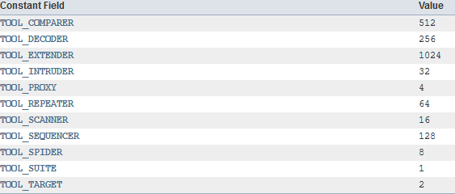
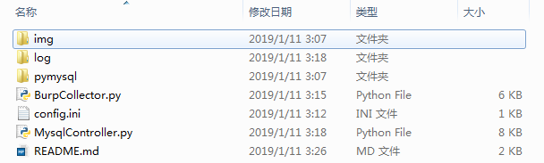
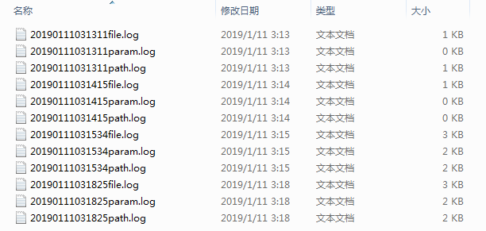
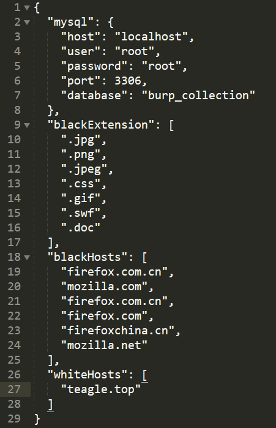
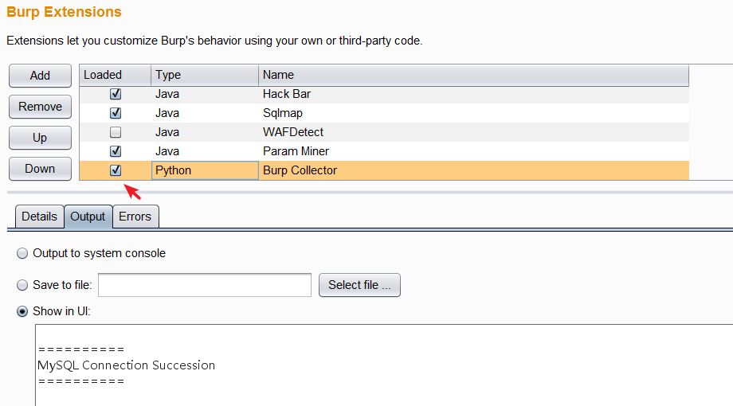
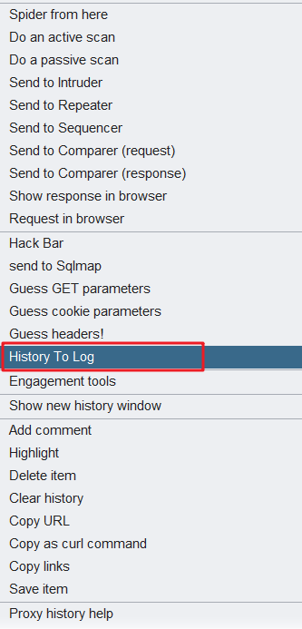
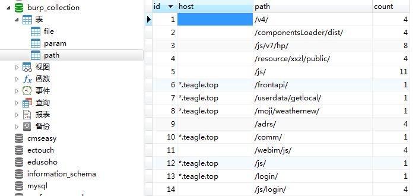

## 演示视频

[](https://teag1e.github.io/viedo/BurpCollectorDemo.mp4)

演示视频：

链接：https://pan.baidu.com/s/1UotjcKmbp-nEjyjfs-AMZA 
提取码：o43z 

## 0x01 结构



### img
存放README里面的图片

### log

存放从Proxy History里面提取的信息

名称是启动插件时的时间



### pymysql

jython的第三方库，用于操作mysql

### BurpCollector.py

插件的主文件，在Burp中需要加载的文件

### config.ini

配置文件



mysql: 数据库的配置

blackExtension： 文件后缀黑名单，用来设置禁止存放进数据库的文件后缀名

blackHosts: 用来存放不提取的主机数据

whiteHosts： 用来设置特别需要关注的主机

假设主机白名单中添加了teagle.top主机

那么该主机或子域下收集到的信息，会在host字段里写入*.teagle.top

不是在主机或者子域下的数据，host字段便为空

>SIDENOTE： 所设定的主机，同样影响其子域

## 0x02 运行流程

BurpSuite在打开时，会逐个加载所安装的插件；在关闭时，会逐个关闭所安装的插件。



在打开BurpSuite或重新加载该插件时，会先进行数据库连接的测试

在连接数据库时，会检测是否存在指定的数据库名，如```burp_collection```数据库；

如果不存在该数据库，那么便会创建该数据库以及所需的表。（数据库结构后续会提到）

当数据库连接成功时，会出现```MySQL Connection Succession```信息。

可以在任意时候任意位置 右键 - History To Log

提取当前Proxy History里面的数据到日志文件

（例如当你需要清除History时，你可以先提取一次数据再进行清除）

 

当卸载插件```Burp Collector```或者关闭```BurpSuite```时

会提取Burp的Proxy工具里面的History里面的数据

将提取到的数据存放到各自的日志文件中

然后再将日志里面数据存放到数据库中

## 0x03 数据库

### 数据库结构

```
burp_collection
	|
	 —— param
			|
			 —— id int not null primary key auto_increment
			 —— param varchar(300) not null
			 —— host varchar(100)
			 —— count int default 1
	|
	 —— directory
			|
			 —— id int not null primary key auto_increment
			 —— directory varchar(300) not null
			 —— host varchar(100)
			 —— count int default 1
	|
	 —— file
			|
			 —— id int not null primary key auto_increment
			 —— file varchar(300) not null
			 —— host varchar(100) 
			 —— count int default 1
```

### param表

存放除cookie外所有请求包里的参数名

如果指定了host白名单，那么便会写入host字段，否则为空

### directory表

存放除去最后一部分，前面的整个path

如果指定了host白名单，那么便会写入host字段，否则为空

如目标URL：http://www.teagle.top/a/b/index.php

那么在directory字段中写入的则是/a/b/

### file表

存放path最后一部分，可以根据需要来提取

如果指定了host白名单，那么便会写入host字段，否则为空

file黑名单

```
.css
.png
.gif
.jpg
.jpeg
```

### 效果图



### 使用数据

导出teagle.top域下面所有收集到的参数名

```
select param from param where host = '*.teagle.top' order by count
```

导出所有的js文件名

```
select file from file where file like '%.js' order by count
```

